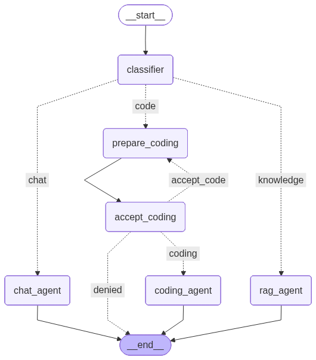

# Agent Orchestrator

A multi-agent chatbot built with [LangGraph](https://langchain-ai.github.io/langgraph/) that classifies your intent, retrieves knowledge with RAG, and ships code through a human-approved Claude Code pipeline — all orchestrated as a single stateful graph.

## What it does

The app (`main.py`) runs an interactive chat loop in the terminal. Every message you type is classified into one of three intents, and the graph routes it to the right agent:

| Intent | Agent | Behavior |
|---|---|---|
| `chat` | Chat agent | A friendly, talkative chatbot (Gemini 2.5 Flash) |
| `knowledge` | RAG agent | Answers using only documents retrieved from an in-memory vector store |
| `code` | Coding agent | Rewrites your request into a clear instruction, asks you to approve it, then runs **Claude Code** on a sandboxed `workspace/` directory |

## Graph architecture



```
START → classifier ──► chat_agent ──────────────► END
                  ──► rag_agent ───────────────► END
                  ──► prepare_coding → accept_coding
                                          │  approve → coding_agent → END
                                          │  deny    → END
                                          │  revise  → back to prepare_coding (loop)
```

### Key concepts demonstrated

- **Shared state** — a `State` `TypedDict` with `messages` (accumulated via `add_messages`), the classified `message_intent`, and a `next_node` routing field, passed to every node.
- **Structured output for routing** — `classify_intent` uses `llm.with_structured_output(IntentClassifier)` (a Pydantic model with a `Literal['chat','knowledge','code']` field) so the LLM's classification is type-safe.
- **Conditional edges** — `add_conditional_edges` routes from the classifier to the right agent, and from the approval node to run / deny / revise.
- **RAG** — a tiny knowledge base is embedded with `gemini-embedding-001` into an `InMemoryVectorStore`; the RAG agent retrieves the top-3 similar documents and is instructed to answer *only* from that context.
- **Human-in-the-loop** — `accept_coding` calls `interrupt(...)`, which pauses the graph and surfaces an approval prompt. The CLI loop detects `__interrupt__` in the result and resumes the graph with `Command(resume=decision)`. Answering with a revised request loops back to `prepare_coding`, forming a **cycle** — the thing that distinguishes LangGraph from a plain chain.
- **Checkpointing** — the graph is compiled with `InMemorySaver` and invoked with a `thread_id`, so conversation state persists across turns (and across the interrupt/resume cycle).
- **Agent delegation** — `prompt_llm_code` shells out to the Claude Code CLI (`claude -p "<instruction>" --permission-mode acceptEdits`) with `cwd` set to `workspace/`, so code edits are confined to that directory.

## Requirements

- Python ≥ 3.12
- [uv](https://docs.astral.sh/uv/) (or pip)
- A Google AI API key (for Gemini chat + embeddings)
- [Claude Code](https://claude.com/claude-code) installed and on your `PATH` (only needed for the `code` intent)

## Setup

```bash
# Install dependencies
uv sync

# Configure your API key
echo 'GOOGLE_API_KEY=your-key-here' > .env
```

## Run

```bash
uv run main.py
```

On startup the graph also renders itself to `graph.png`. Then just chat:

```
Enter message : hi there!                      # → chat agent
Enter message : what is LangGraph?             # → RAG agent
Enter message : create a hello.py in the repo  # → coding pipeline (asks for approval first)
```

When a coding request is detected you'll see:

```
About to run Claude Code with request:

<rewritten instruction>

Approve? (yes/no, or type a revised request)
```

- `yes` — runs Claude Code in `workspace/`
- `no` — cancels
- anything else — treated as a revised request and re-prepared

## Project structure

```
├── main.py        # the whole graph: state, nodes, edges, CLI loop
├── workspace/     # sandbox directory Claude Code operates in
├── graph.png      # auto-generated diagram of the compiled graph
└── pyproject.toml # dependencies (langgraph, langchain, langchain-google-genai)
```
