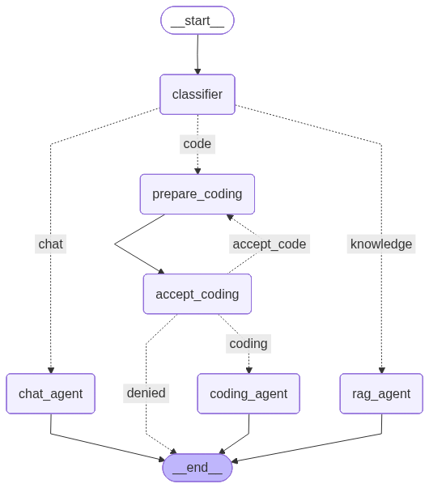

# Agent Orchestrator

One chatbot gives a business a single, reliable front door for customer conversations and internal requests: it handles casual chat, answers questions using only the client's loaded documents, and routes code changes through an approval step before anything runs. [LangGraph](https://langchain-ai.github.io/langgraph/) coordinates those specialists behind the scenes, while Gemini 2.5 Flash handles conversation and Claude Code carries out approved work in a sandboxed `workspace/` directory.

## What it does

The terminal app gives every request to the specialist best suited to handle it:

| Intent | Agent | Behavior |
|---|---|---|
| `chat` | Chat agent | Handles everyday conversation with fast, friendly responses powered by Gemini 2.5 Flash. |
| `knowledge` | RAG agent | Answers customer or staff questions only from the three most relevant passages in the loaded document set, and says it does not know when the documents do not support an answer. |
| `code` | Coding agent | Clarifies the requested code change, pauses so a person can approve, deny, or revise it, then sends approved work to **Claude Code** inside the sandboxed `workspace/` directory. |

**Why chat matters:** People get a natural response from the same assistant even when their request does not require company knowledge or a technical action.

**Why knowledge matters:** Customers and staff receive answers grounded in the material the business provides instead of plausible-sounding guesses.

**Why code matters:** The approval gate lets the assistant take real action while keeping a person in control of every change.

## Notes for production

- Replace `InMemorySaver` with a persistent checkpointer so conversations and approval requests survive process restarts.
- Replace the sample `KNOWLEDGE` list and in-memory vector store with a controlled document-ingestion process and durable, client-isolated storage.
- Add an evaluation harness for retrieval quality, grounded answers, and the agent's ability to say it does not know when evidence is missing.
- Add authentication, authorization, tenant isolation, and rate limiting before exposing the service to customers or staff.
- Move API keys and other credentials out of local `.env` files and into a managed secret store with rotation and access controls.
- Harden code execution beyond the demo `workspace/` boundary with deployment-appropriate isolation, command restrictions, timeouts, and audit logs.

## Graph architecture



```
START → classifier ──► chat_agent ──────────────► END
                  ──► rag_agent ───────────────► END
                  ──► prepare_coding → accept_coding
                                          │  approve → coding_agent → END
                                          │  deny    → END
                                          │  revise  → back to prepare_coding (loop)
```

### Key concepts demonstrated

- **Shared state** — a `State` `TypedDict` with `messages` (accumulated via `add_messages`), the classified `message_intent`, and a `next_node` routing field, passed to every node.
- **Structured output for routing** — `classify_intent` uses `llm.with_structured_output(IntentClassifier)` (a Pydantic model with a `Literal['chat','knowledge','code']` field) so the LLM's classification is type-safe.
- **Conditional edges** — `add_conditional_edges` routes from the classifier to the right agent, and from the approval node to run / deny / revise.
- **RAG** — a tiny knowledge base is embedded with `gemini-embedding-001` into an `InMemoryVectorStore`; the RAG agent retrieves the top-3 similar documents and is instructed to answer *only* from that context.
- **Human-in-the-loop** — `accept_coding` calls `interrupt(...)`, which pauses the graph and surfaces an approval prompt. The CLI loop detects `__interrupt__` in the result and resumes the graph with `Command(resume=decision)`. Answering with a revised request loops back to `prepare_coding`, forming a **cycle** — the thing that distinguishes LangGraph from a plain chain.
- **Checkpointing** — the graph is compiled with `InMemorySaver` and invoked with a `thread_id`, so conversation state persists across turns (and across the interrupt/resume cycle).
- **Agent delegation** — `prompt_llm_code` shells out to the Claude Code CLI (`claude -p "<instruction>" --permission-mode acceptEdits`) with `cwd` set to `workspace/`, so code edits are confined to that directory.

## Requirements

- Python ≥ 3.12
- [uv](https://docs.astral.sh/uv/) (or pip)
- A Google AI API key (for Gemini chat + embeddings)
- [Claude Code](https://claude.com/claude-code) installed and on your `PATH` (only needed for the `code` intent)

## Setup

```bash
# Install dependencies
uv sync

# Configure your API key
echo 'GOOGLE_API_KEY=your-key-here' > .env
```

## Run

```bash
uv run main.py
```

On startup the graph also renders itself to `graph.png`. With relevant company product material loaded into `KNOWLEDGE`, a support-to-engineering handoff can look like:

```
Enter message : Does the Business plan support SSO?                       # → knowledge agent; answers only from loaded company documents
Enter message : Update the pricing page so its SSO details are accurate   # → coding pipeline; drafts the change and pauses for approval
```

When a coding request is detected you'll see:

```
About to run Claude Code with request:

<rewritten instruction>

Approve? (yes/no, or type a revised request)
```

- `yes` — runs Claude Code in `workspace/`
- `no` — cancels
- anything else — treated as a revised request and re-prepared

## Project structure

```
├── main.py        # the whole graph: state, nodes, edges, CLI loop
├── workspace/     # sandbox directory Claude Code operates in
├── graph.png      # auto-generated diagram of the compiled graph
└── pyproject.toml # dependencies (langgraph, langchain, langchain-google-genai)
```
